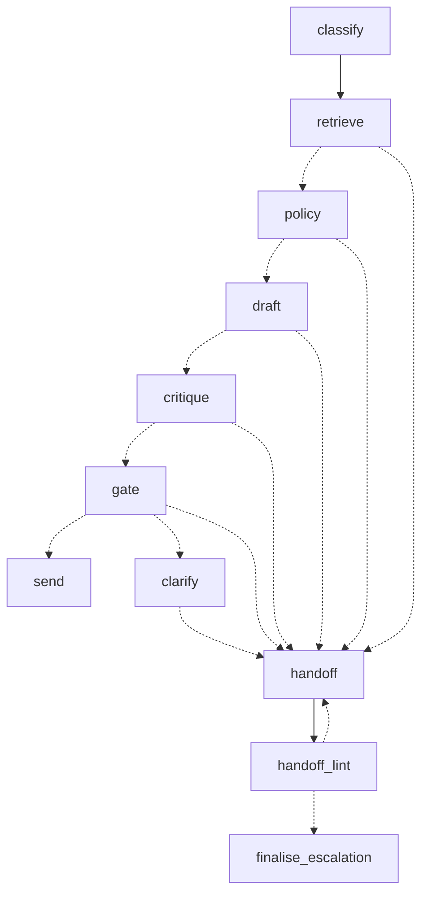

# Customer-support deflection with an escalation ladder

A worked example of **confidence-gated routing**: a ticket comes in, an automated tier-1
agent tries to answer it from a knowledge base, and an independent reviewer decides
whether that answer is good enough to send, good enough to ask one follow-up question
about, or not good enough at all — in which case the agent writes a **handoff packet** for
a human colleague and gets out of the way.

The interesting artifact here is the handoff packet, not the answer. Any RAG pipeline can
answer easy tickets. The thing worth building carefully is what happens on the ~30% it
cannot: whether the human who inherits the ticket starts a minute ahead of where they
would have started with the raw email, or a minute behind.

```
                    ┌─────────────┐
   ticket  ────────▶│  classify   │  category, severity, risk, "does this need
                    └──────┬──────┘   account data I cannot see?"
                           ▼
                    ┌─────────────┐
                    │  retrieve   │  BM25 over the help centre (local, cannot fail)
                    └──────┬──────┘
                           ▼
                    ┌─────────────┐   legal · security · churn · money over the
                    │ policy gate │   approval line · pasted secrets · repeat
                    └──────┬──────┘   escalations  ──────────────────────┐
                           ▼                                             │
                    ┌─────────────┐                                      │
                    │ tier-1 draft│  writes the reply AND declares what   │
                    └──────┬──────┘  it could not support                 │
                           ▼                                             │
                    ┌─────────────┐  a separate call that did not write   │
                    │  critique   │  the draft and is told to distrust it │
                    └──────┬──────┘                                       │
                           ▼                                             │
                    ┌─────────────┐  model judgement × mechanical checks  │
                    │    fuse     │  (do the cited articles exist?)       │
                    └──────┬──────┘                                       │
                           ▼                                             │
              ┌────────────┼────────────┐                                │
         ≥0.78│       0.45─0.78│        │<0.45                           │
              ▼            ▼            ▼                                ▼
          ┌───────┐   ┌─────────┐   ┌──────────────────────────────────────┐
          │ SEND  │   │ CLARIFY │   │  ESCALATE  →  handoff packet          │
          └───────┘   └─────────┘   └──────────────────────────────────────┘
                       only if the      written for a colleague, not a customer
                       missing piece    ├─ lint-checked for customer voice
                       is the           └─ falls back to an auto-assembled packet
                       customer's          if the model itself is unavailable
                       to give
```

## Run it

```bash
python3 -m venv .venv && .venv/bin/pip install -e ".[dev]"
```

**Everything except the live model calls runs with no API key.** The demo replays all
three routes — send, clarify, escalate — through the real ladder, the real confidence
fusion, and the real renderer, with only the model's words canned:

```bash
.venv/bin/python examples/offline_demo.py
```

```bash
.venv/bin/support-agent search "dashboard numbers are stale" -v
```

```bash
.venv/bin/python -m pytest -q
```

The full ladder needs one. Set `ANTHROPIC_API_KEY`, then:

```bash
.venv/bin/support-agent run examples/tickets/*.json
```

Each ticket prints its route, the confidence breakdown, the reply or the rendered handoff
brief, and a per-stage trace with token counts. `--json` emits the whole `Resolution`
object instead; `support-agent lint packet.json` re-checks a saved packet.

## The three design decisions worth stealing

### 1. Confidence is not what the model says its confidence is

Asking a model to rate the answer it just wrote produces a number that is fluent and
uncalibrated. Two things fix most of that:

**The reviewer is a separate call.** [`stages/critic.py`](src/support_agent/stages/critic.py)
gets the same passages and the finished draft, is told it did not write it, and is told to
assume the draft is wrong until the passages say otherwise. It scores groundedness,
coverage, and *action safety* — how expensive it is to be wrong — independently, because
those fail in different directions. A reply can be perfectly grounded and still unsafe to
send unreviewed.

**Then the score is fused with checks the model cannot argue with.** Chiefly: did the
drafter cite an article that retrieval never actually returned? If so, it is not reasoning
from the evidence, and the score is capped at 0.25 no matter how good the prose is.
Retrieval strength, self-reported unsupported claims, and hard floors on groundedness,
action safety, and coverage all feed in as caps rather than weights — a floor is not
something a strong score elsewhere should be able to buy its way past.

```python
score = 0.40*groundedness + 0.25*action_safety + 0.20*coverage + 0.15*retrieval
# then capped by: fabricated citations · weak retrieval · KB gaps
#                 floors on groundedness, action safety, and coverage
#                 and one consistency rule (below)
```

The last cap is not a tuning knob at all. If the reviewer set
`blocked_on_customer_input`, the score cannot reach the send threshold — the pipeline may
not hand over a finished answer and say it needs more information in the same breath. That
one line is what turned a plausible-looking 0.81 into a clarifying question during
development; the demo's second scenario is the case that found it.

### 2. "Ask a question" and "escalate" are different failures

Both mean *not confident*. The thing that separates them is one boolean:
`blocked_on_customer_input` — can the customer themselves supply the missing piece? An
invoice number, which of two things they meant, what the error actually said: ask. Data
that lives in our systems, a judgement call, or a draft that is simply wrong: escalate.

Asking a customer a question we could have answered ourselves is worse than escalating,
because it spends their patience *and* still ends up on a human's desk. So the ladder caps
clarifying questions at one round, and after that the ticket goes to a person carrying the
question we already asked.

### 3. The handoff packet is written for a colleague, and that is harder than it sounds

Every other stage in this pipeline writes to a customer. By the time the model reaches the
handoff, its priors about "support text" are loaded, and they are exactly wrong: the brief
comes out opening with "Thanks for reaching out", apologising to nobody in the room, and
hedging a clear policy statement into mush.

Two things push back. The system prompt in
[`stages/handoff.py`](src/support_agent/stages/handoff.py) spends most of its length on
audience — *your reader has eleven other tickets and forty seconds* — and specifies each
field by what makes it useful rather than what it contains. And
[`handoff_lint.py`](src/support_agent/handoff_lint.py) checks the result mechanically
and **sends it back to be rewritten once if it fails**:
customer-voice phrases, greetings, stacked hedges, next steps that are not steps
("investigate further"), findings that trace to no article, bare open questions, and a
missing statement of what was already sent. Being plain string rules, they are asserted in
the test suite with no judge model and no API key.

Errors trigger a rewrite that names the specific defects — repeating the style rules would
just repeat what the model already had and ignored. Warnings are recorded and shipped: a
slightly long subject line is not worth another model call. Two failures in a row means a
prompt problem rather than a sampling problem, so the loop stops and the packet ships with
the complaint attached to the trace.

The field that matters most is `already_told_customer`. A colleague who contradicts
something the bot already said turns a support ticket into a complaint.

Here is a real one, from `examples/offline_demo.py`:

```markdown
# [Billing/High] Duplicate $960 annual charge - refund authorisation  ·  `TKT-1003`

**Priority:** high  ·  **Blocked on:** Needs account data the agent cannot read

Brightpath Logistics was charged $960 on consecutive days and wants the second charge
refunded today with written confirmation.

> **Why this is not answered already:** Confirming this is a duplicate rather than a
> proration requires invoice line items the agent cannot read, and the amount is above
> the agent's approval line.

## Already said to the customer

Nothing has been sent to the customer.

## What the agent already did

- Retrieved the refund policy and the billing-cycle article.
- Confirmed duplicate charges are refundable in full with no approval step (kb-011).
- Could not confirm the two charges are actually duplicates - invoice line items are not
  visible to the agent.

## Findings

- Duplicate or double charges are refunded in full, no approval needed (kb-011).
- Adding seats mid-cycle charges a prorated amount immediately, which can look like a
  second subscription charge (kb-010).
- Refunds go to the original payment method and take 5-10 business days (kb-011).
- Account renews annually in advance; two same-amount charges a day apart is not a normal
  renewal pattern.

## Open questions

- Whether the second $960 charge is a true duplicate or a mid-cycle seat addition that
  happens to match the renewal amount - the agent cannot read invoice line items.
- Whether the customer's finance team has already raised a chargeback, which would change
  how this is resolved.

## Next steps

1. Pull both charges for acct_2290 in Stripe and compare line items and invoice IDs.
2. If both are renewals, refund the later charge - no approval needed under kb-011.
3. If the second is a seat addition, reply explaining the proration rather than refunding,
   and copy the invoice line items.
4. Either way, send written confirmation the same day; they have committed to their CFO.

## Risk flags

- Customer has escalated this internally to their CFO.
- $1,600/mo account, 26 months tenure, CSAT 5 - a good account having a bad week.
```

Note what the second finding is doing. The agent is not just assembling the case for a
refund — it surfaced the article that says a mid-cycle seat addition produces a second
charge that *looks* like a duplicate, and put the alternative explanation in front of the
human before they act. That is the difference between a summary and a brief.

## Graceful degradation

Every model call is wrapped. A 500, a rate limit, a schema violation, and a refusal are
the same event to the ladder: *this rung is unavailable, take the next one down.* There is
no path out of `Ladder.run` that does not return a `Resolution`.

| What fails | What happens |
|---|---|
| Triage | Escalate immediately, with the honest reason. Retrieval still ran, so the packet has evidence. |
| Draft | Escalate with no draft. The packet says so. |
| Critique | Escalate **with** the draft attached. We have an answer that nothing checked — that is what a review queue is for. |
| Clarify | Fall through to escalation rather than send the unverified draft. |
| Handoff | Assemble a packet deterministically from whatever was collected. Worse than a written one, but it still says what is known, what was said, and why it is here. |

Note the direction: a degraded pipeline is never a *more permissive* one. Triage failing
does not mean the ticket sails through the policy gate on a default classification — it
means the ticket goes to a human with "we never classified this" written on it.

## The graph

The ladder is a LangGraph `StateGraph`. The split is deliberate: the topology lives alone
in [`graph.py`](src/support_agent/graph.py), so the entire routing policy of the
application is about forty lines with every branch named after the reason it exists, and
the node bodies live in [`nodes.py`](src/support_agent/nodes.py).
[`ladder.py`](src/support_agent/ladder.py) is a facade — `Ladder(llm, kb).run(ticket)`
still takes a ticket and returns a `Resolution`, which is all most callers want.

`Ladder.draw()` emits the compiled topology as Mermaid:



Three things this bought that the imperative version did not have:

**The lint loop became a real edge.** Previously `lint_packet` ran, wrote its findings to
the trace, and shipped the packet anyway — a quality check that only ever complained. It
is now a conditional edge back to the handoff node, bounded at one rewrite.

**A structural guarantee, asserted rather than asserted-by-comment.** Every failure edge
points at `handoff`, and `gate` is the only node that can reach `send`. That was true of
the imperative version too, but only if you read all 440 lines carefully.
`test_every_failure_edge_points_at_the_handoff` now checks it against the *compiled*
graph, so a future stage that quietly falls through to `send` fails a test rather than
escaping review.

**Durability.** `LadderState` is serialisable end to end, so `Ladder(..., checkpointer=...)`
persists a run and threads default to the ticket id — a ticket coming back after a
clarifying question resumes its own history instead of re-deriving it. What I did *not*
wire up is `interrupt()` for the human-review step: it is the natural next move and maps
exactly onto `escalate`, but it changes `run()` from "returns a Resolution" to "may return
a pause", and that is a calling-contract change worth making deliberately rather than as a
side effect of a port.

What stayed out of the graph: [`llm.py`](src/support_agent/llm.py) still talks to Claude
through the Anthropic SDK directly, and [`policy.py`](src/support_agent/policy.py) is
still plain deterministic Python. Neither gains anything from the framework, and `llm.py`
would lose per-stage `effort`, cache-control placement, refusal handling, and — the
expensive one — `ScriptedLLM`, which is why 122 tests run in under half a second with no
network.

## The policy gate

Some tickets see a person regardless of how confident the model is. Encoding that as a
threshold would be a mistake: thresholds get tuned, and the day someone lowers `auto_send`
from 0.78 to 0.72 to lift the deflection rate should not be the day the agent starts
denying refunds to accounts that mentioned their lawyer.

So [`policy.py`](src/support_agent/policy.py) is a separate, readable, deterministic layer
that runs *before* any confidence score is computed, and it short-circuits the two most
expensive stages when it fires. Rules are ordered most-serious-first so the reason attached
to the escalation is the one a human would lead with.

## Layout

| Path | What it is |
|---|---|
| [`models.py`](src/support_agent/models.py) | Every stage contract. LLM-facing schemas have no optional fields — "nothing to report" is an empty list, never an absent key. |
| [`config.py`](src/support_agent/config.py) | Thresholds and policy constants. Every number here is a product decision. |
| [`retrieval.py`](src/support_agent/retrieval.py) | BM25 over heading-level chunks, no dependencies. Swap `search()` for an embedding lookup and nothing else changes. |
| [`policy.py`](src/support_agent/policy.py) | Deterministic escalation rules. |
| [`stages/`](src/support_agent/stages) | One module per rung. All the prompts live here. |
| [`graph.py`](src/support_agent/graph.py) | The LangGraph topology — the whole routing policy, on one screen. |
| [`nodes.py`](src/support_agent/nodes.py) | The node bodies and the graph state. |
| [`ladder.py`](src/support_agent/ladder.py) | The facade: `Ladder(llm, kb).run(ticket) -> Resolution`. |
| [`handoff_lint.py`](src/support_agent/handoff_lint.py) | Mechanical quality checks on the brief. |
| [`llm.py`](src/support_agent/llm.py) | The only module that talks to Claude. `ScriptedLLM` is the same interface with no network. |
| [`kb/`](src/support_agent/kb) | Twelve help-centre articles for a fictional analytics SaaS. |
| [`examples/offline_demo.py`](examples/offline_demo.py) | All three routes, scripted end to end, no credentials. |

## Testing without an API key

`ScriptedLLM` implements the same protocol as the real client and returns whatever objects
you hand it — including `LLMError` instances, which it raises. That makes every branch
assertable in milliseconds:

```python
llm = ScriptedLLM(responses={
    "classify": make_classification(),
    "draft":    make_draft(),
    "critique": LLMError("critique", "connection error"),
    "handoff":  make_packet(),
})
result = Ladder(llm, kb, settings).run(ticket)

assert result.route == "escalate"
assert result.draft is not None      # the human still gets to see it
assert result.confidence is None     # but nothing verified it
```

122 tests cover retrieval, every policy rule, the fusion caps and floors, every lint rule,
all four routes, all five degradation paths, the lint rewrite loop, and the topology
itself.

## Adapting this

- **Real knowledge base**: replace `KnowledgeBase.search`. The rest of the pipeline only
  needs `RetrievedChunk` objects with an `article_id`, a `score` in 0..1, and text.
- **Real thresholds**: the ones in `config.py` are guesses. Label a few hundred resolved
  tickets, run the ladder over them, and put `auto_send` where the send-when-wrong rate
  crosses whatever your team can live with. The `Resolution.trace` is built for exactly
  this.
- **Real handoff destination**: `HandoffPacket` is a typed object precisely so it can
  become a Zendesk internal note, a Linear issue, or a Slack blockquote.
  `render.py` does the markdown one.

## Notes on the API usage

Every stage uses [structured outputs](https://platform.claude.com/docs/en/build-with-claude/structured-outputs)
via `client.messages.parse(output_format=Model)`, so a stage either returns a validated
Pydantic object or raises — there is no "the model returned prose this time" branch
anywhere in the pipeline. Per-stage `effort` is set in `config.py` (triage is shallow;
critique and the handoff are not), the long system prompts carry a cache breakpoint, and
`stop_reason: "refusal"` is handled as just another unavailable rung.
